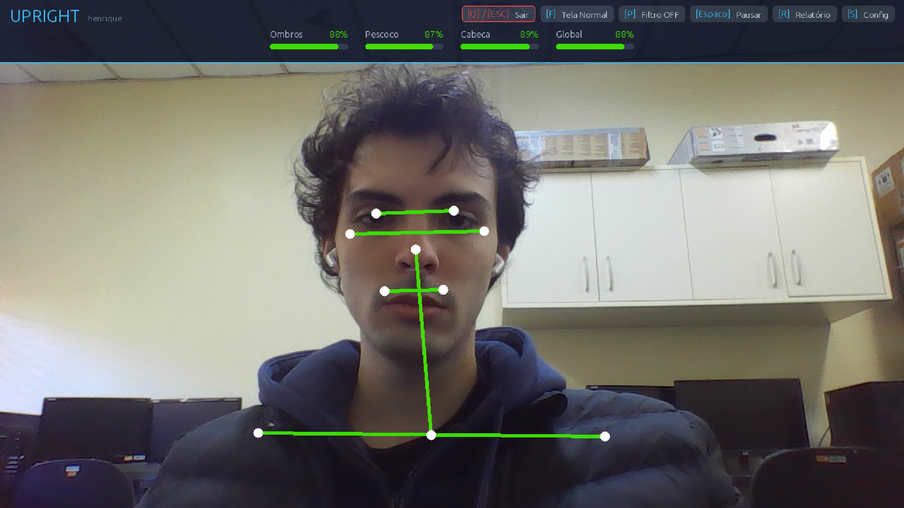
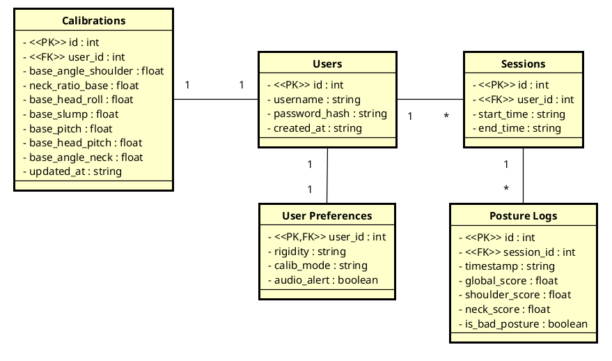
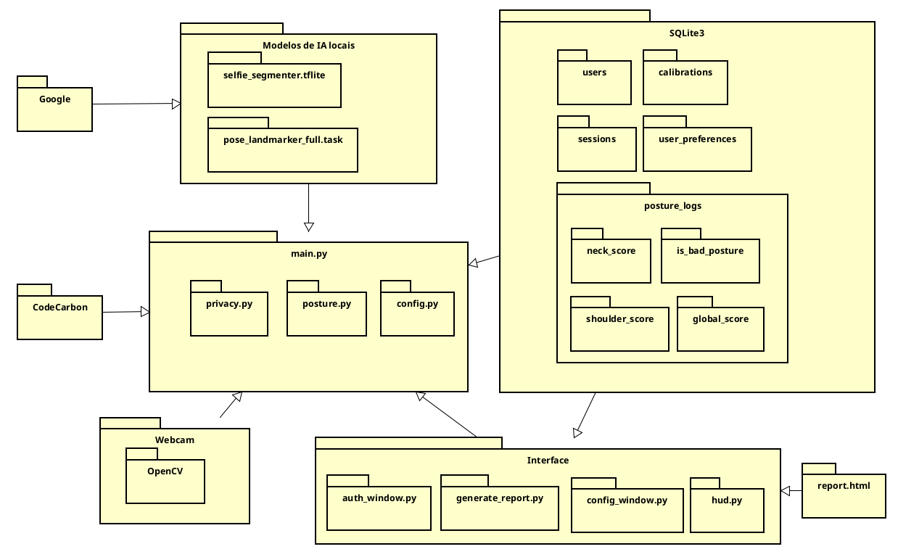

# Upright

**Upright** é um sistema de monitoramento de postura corporal em tempo real que usa a câmera do computador para detectar má postura (ombros caídos, pescoço inclinado/projetado para frente) e gerar alertas visuais instantâneos, além de registrar um histórico de sessões no banco de dados local.

> Versão atual: **1.0** · Python 3.10 · MediaPipe Tasks API · SQLite3

<div align="center">
  
</div>

---

## Índice

1. [Compatibilidade por sistema operacional](#compatibilidade)
2. [Pré-requisitos](#pré-requisitos)
3. [Instalação](#instalação)
4. [Baixando os modelos de IA](#baixando-os-modelos-de-ia)
5. [Como rodar](#como-rodar)
6. [Argumentos disponíveis](#argumentos-disponíveis)
7. [Atalhos de teclado](#atalhos-de-teclado)
8. [Gerando um executável](#gerando-um-executável)
9. [Estrutura do projeto](#estrutura-do-projeto)
10. [Dependências](#dependências)
11. [Banco de dados](#banco-de-dados)
12. [Troubleshooting](#troubleshooting)
13. [Documentação e Artefatos](#documentação-e-artefatos)

---

## Compatibilidade

### Linux (recomendado)
Suporte completo, incluindo aceleração por GPU via OpenGL ES (NVIDIA/AMD). Testado em Ubuntu 22.04+.

### Windows
O delegate GPU do MediaPipe Tasks usa OpenGL ES, que **não é suportado nativamente no Windows**. O app roda normalmente em **modo CPU** (`--cpu`, que é o padrão). Os scripts `.sh` precisam do Git Bash ou WSL para executar.

### macOS
O delegate GPU usa Metal no macOS mas **não é oficialmente suportado** pela versão atual do MediaPipe Tasks. Rode sempre com `--cpu`. Os scripts `.sh` rodam nativamente no Terminal.

---

## Pré-requisitos

### Todos os sistemas
- [Miniconda](https://docs.conda.io/en/latest/miniconda.html) ou [Anaconda](https://www.anaconda.com/) instalado e inicializado (`conda init bash` ou `conda init zsh`).
- Webcam conectada e funcionando.
- `curl` ou `wget` para baixar os modelos de IA.

### Linux (adicional)
- Usuário no grupo `video` para acesso à câmera (ver [Troubleshooting](#troubleshooting)).
- Para modo GPU: driver NVIDIA/AMD com suporte a OpenGL ES 3.1+.

---

## Instalação e Uso (Usuários Finais)

A forma mais fácil de usar o Upright é baixando o executável pronto. **Você não precisa instalar Python nem linha de comando.**

1. Acesse a página de **[Releases](https://github.com/htrein/upright/releases)** do projeto.
2. Baixe o arquivo correspondente ao seu sistema:
   - **Windows:** Baixe a pasta compactada ou instalador contendo `upright.exe`.
   - **Linux:** Baixe a pasta compactada contendo o executável `upright` (sem extensão).
3. **Execute o aplicativo:**
   - **No Windows:** Basta dar dois cliques no `upright.exe` baixado.
   - **No Linux:** Abra o terminal na pasta onde baixou e dê permissão de execução: `chmod +x upright`, em seguida rode com `./upright`.

> **Nota:** Na primeira vez que rodar, o aplicativo criará automaticamente um banco de dados local (`posture_history.db`) na mesma pasta onde o executável está localizado. Mantenha-o em uma pasta fixa (ex: Documentos ou Área de Trabalho).

---

## Para Desenvolvedores (Rodando do Código-Fonte)

Se você deseja modificar o código ou rodar via terminal, siga os passos abaixo.

### 1. Clone o repositório

```bash
git clone https://github.com/htrein/upright.git
cd upright
```

### 2. Crie o ambiente Conda

```bash
conda env create -f environment-mediapipe.yml
```

Esse comando cria o ambiente chamado `mediapipe` com todas as dependências Python necessárias (Python 3.10, OpenCV, MediaPipe, etc).

### 3. Baixe os modelos de IA

Os modelos de detecção não estão incluídos no repositório por serem arquivos grandes. Baixe-os com:

```bash
# No Linux/macOS ou Git Bash do Windows
chmod +x scripts/download_mp_tasks.sh
./scripts/download_mp_tasks.sh
```

Isso irá baixar automaticamente os modelos para a pasta `src/models/`.

### 4. Como rodar do código-fonte

```bash
conda activate mediapipe
cd src/

# CPU (padrão)
python main.py

# GPU (Linux com OpenGL ES)
python main.py --gpu
```

---

## Argumentos disponíveis

| Argumento | Descrição | Compatibilidade |
|---|---|---|
| _(nenhum)_ | Roda em modo CPU (comportamento padrão) | Todos |
| `--cpu` | Força modo CPU explicitamente | Todos |
| `--gpu` | Usa GPU para inferência (OpenGL ES delegate) | Apenas Linux |

**Exemplo:**
```bash
python3 main.py --gpu     # GPU no Linux
python3 main.py --cpu     # CPU em qualquer sistema
```

> O sistema faz **fallback automático para CPU** se `--gpu` for passado mas a GPU não estiver disponível ou incompatível. Uma mensagem de aviso é exibida no terminal.

---

## Atalhos de teclado

Esses atalhos funcionam com a janela do app em foco:

| Tecla | Ação |
|---|---|
| `C` | Calibrar postura atual como base (use quando estiver sentado reto!) |
| `S` | Abrir janela de configurações (sensibilidade) |
| `R` | Gerar relatório HTML da sessão atual e abrir no navegador |
| `P` | Ativar/desativar modo privacidade (oculta o vídeo) |
| `M` | Alternar estilo de privacidade: silhueta → blur → mosaico |
| `Space` | Pausar/retomar o rastreamento |
| `F` | Alternar entre tela cheia e janela normal |
| `Esc` | Encerrar o programa |

---

## Fluxo de uso típico

1. **Inicie o app** → faça login ou cadastre-se na janela de autenticação.
2. **Sente-se em posição ereta** → pressione `C` para calibrar sua postura base.
3. **Trabalhe normalmente** → o app monitora em tempo real no canto da tela.
4. **Ajuste a sensibilidade** → pressione `S` se os alertas estiverem muito frequentes ou raros.
5. **Ao terminar** → pressione `R` para ver o relatório do dia, ou `Esc` para sair.

---

## Gerando um executável

Você pode gerar um **único arquivo executável** que não exige Python instalado para rodar.

### Pré-requisito
Ter o ambiente conda com as dependências criado (etapa de instalação).

### Gerar o executável

```bash
chmod +x scripts/build_exe.sh
./scripts/build_exe.sh [nome_do_ambiente]

# Exemplo:
./scripts/build_exe.sh mediapipe
```

O executável será gerado em: `dist/upright`

### Usando o executável

```bash
# CPU (padrão, compatível com tudo)
./dist/upright

# GPU (apenas Linux)
./dist/upright --gpu
```

### Avisos importantes sobre executáveis

- O executável gerado é **específico para o sistema operacional** onde foi buildado. Um executável Linux **não roda** no Windows e vice-versa.
- O arquivo de banco de dados (`posture_history.db`) e o relatório (`report.html`) serão criados **na mesma pasta de onde o aplicativo for executado**. Os modelos de IA já estão embutidos (você não precisa enviar a pasta `models/`).
- Para distribuir para outros sistemas, o build precisa ser feito naquele sistema.

| SO Alvo | Como gerar |
|---|---|
| Linux | Rodar `build_exe.sh` no Linux |
| Windows | Instalar Python + PyInstaller no Windows e rodar `pyinstaller` manualmente |
| macOS | Rodar `build_exe.sh` no macOS |

---

## Estrutura do projeto

```
upright/
├── environment-mediapipe.yml   # Dependências do ambiente Conda
├── README.md
│
├── mediapipe/                  # Código-fonte principal
│   ├── main.py                 # Ponto de entrada — loop principal da câmera
│   ├── config.py               # Variáveis de configuração e estado global
│   ├── posture.py              # Lógica de cálculo de ângulos e scores de postura
│   ├── hud.py                  # HUD (cabeçalho visual) sobreposto ao vídeo
│   ├── db.py                   # Banco de dados SQLite (usuários, sessões, logs)
│   ├── auth_window.py          # Janela de autenticação (CustomTkinter)
│   ├── config_window.py        # Janela de configurações (CustomTkinter)
│   ├── privacy.py              # Filtros de privacidade (blur, silhueta, mosaico)
│   ├── generate_report.py      # Gerador de relatório HTML interativo
│   ├── posture_history.db      # Banco de dados local (gerado automaticamente)
│   ├── emissions.csv           # Log de estimativas de emissão de CO₂ (gerado automaticamente)
│   ├── METRICS.md              # Documentação técnica das métricas de postura
│   └── models/                 # Modelos de IA do MediaPipe (baixar via script)
│       ├── pose_landmarker_full.task
│       └── selfie_segmenter.tflite
│
└── scripts/
    ├── run_mediapipe.sh        # Script para rodar o app com conda (suporta --cpu / --gpu)
    ├── build_exe.sh            # Script para gerar executável com PyInstaller
    └── download_mp_tasks.sh    # Script para baixar os modelos de IA
```


---

## Dependências

Gerenciadas automaticamente pelo `environment-mediapipe.yml`:

| Pacote | Versão | Papel |
|---|---|---|
| `python` | 3.10 | Linguagem base |
| `mediapipe` | latest | Detecção de poses e segmentação (Tasks API) |
| `opencv` | latest | Captura de câmera e processamento de imagem |
| `numpy` | latest | Operações matriciais para análise de frames |
| `customtkinter` | latest | Janelas de autenticação e configuração |
| `Pillow` | latest | Suporte a imagens nas janelas Tkinter |
| `matplotlib` | latest | Gráficos para o relatório de postura |
| `absl-py` | latest | Utilitários internos do MediaPipe |
| `protobuf` | latest | Serialização de dados (dependência do MediaPipe) |
| `codecarbon` _(opcional)_ | latest | Estimativa de emissões de CO₂ durante a sessão |

Para instalar `codecarbon` (opcional):
```bash
conda activate mediapipe
pip install codecarbon
```

---

## Banco de dados

O app usa **SQLite3** local, sem servidor. O arquivo `posture_history.db` é criado automaticamente na primeira execução dentro da pasta `mediapipe/`.

### Tabelas

| Tabela | Descrição |
|---|---|
| `users` | Usuários cadastrados (username único, senha com hash SHA-256) |
| `calibrations` | Ângulos de referência calibrados por usuário (ombro, pescoço, cabeça) |
| `user_preferences` | Configurações de sensibilidade (rigidez: Normal / Rigoroso / Relaxado) |
| `sessions` | Registro de cada sessão de uso (início e fim) |
| `posture_logs` | Score de postura registrado a cada ~1s por sessão |

> O banco é criado localmente e **nenhum dado é enviado para a internet**.

---

## Documentação e Artefatos

### Apresentações (Pitches)
- [Pitch de proposta (PDF)](Pitch%20de%20proposta.pdf)
- [Pitch Médio (PDF)](Pitch%20Medio.pdf)
- [Pitch Final 5min (PDF)](Pitch%20Final%205min.pdf)
- [Pitch Final 10min (PDF)](Pitch%20Final%2010min.pdf)

### Relatório Final
- [Relatório Final (PDF)](Relatorio%20Final.pdf)

### Diagramas do Sistema
Os projetos originais do Astah estão disponíveis no repositório (`.asta`). Abaixo estão as exportações em imagem:

#### Diagrama de Classes
[Projeto Astah: diagrama_classes.asta](diagrama_classes.asta)
<br>


#### Diagrama de Pacotes
[Projeto Astah: diagrama_pacotes.asta](diagrama_pacotes.asta)
<br>
